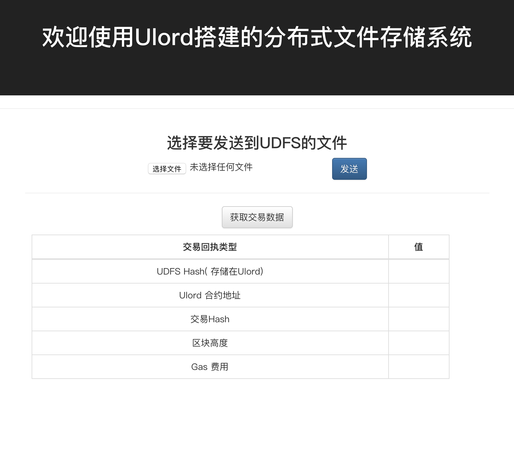
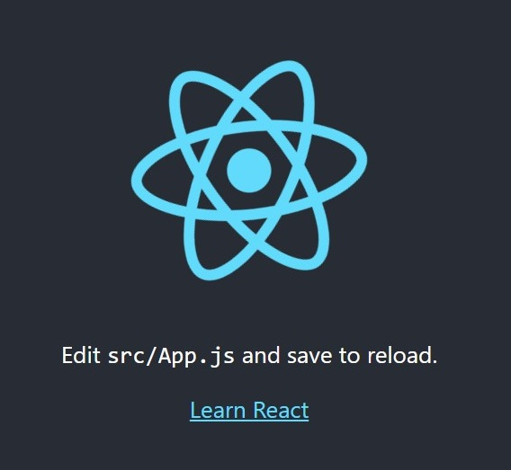
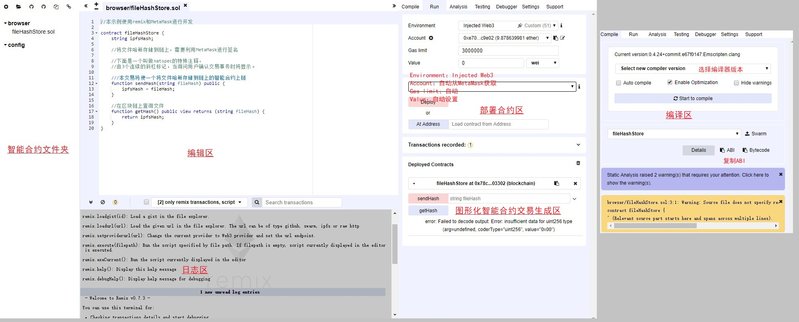
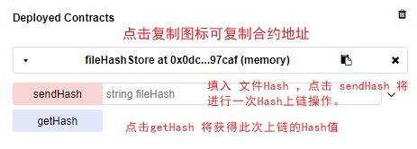
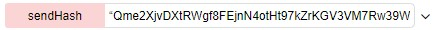
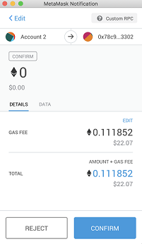
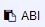

# UDFS_Uploader

[TOC]

## 1.简介
**UDFS_Uploader** 是一个为社区开发者熟悉Ulord使用而创建的demo项目，跟随本教程重新开发一遍本项目，您将了解到如何在Ulord上开发出属于自己的分布式应用程序，本项目还是Ulord开发者指南系列的初级项目。

本项目实现了一个分布式文件存储系统，实现上首先将文件存储在UDFS（Ulord分布式存储系统）上，再将Hash（一种文件特征码）存储在Ulord链上。

 文件Hash可以验证文件正确性，在链上存储文件Hash后此Hash不会被篡改，而文件存储在支持版本控制的UDFS上，我们可以通过文件Hash得到文件的特定版本并验证文件是否正确。


   本教程运行效果如图所示：


```
              +----------+
              |          |
     +--------+   DAPP   +---------+
     |        |          |         |
     |        +----+-----+         |
 file|             ^               |
     |             |               |  fileHash
     |             | fileHash      |
     |             |               |
+----v----+        |          +----v----+
|         |        |          |         |
|  UDFS   +--------+          |   USC   |
|         |                   |         |
+---------+                   +---------+

           UDFS Uploader 原理图
```


本项目通过`UDFS api` 将文件上传至UDFS 网络，UDFS返回文件Hash值给DAPP，通过web3j我们可以很方便地让前端与区块链进行交互，这里我们利用web3j和Chrome浏览器的钱包插件MetaMask交互，调用智能合约`fileHashStore`中的方法将文件Hash保存到Ulord测试侧链USC中，DAPP利用了web3 V1.0.0 的新特性 `async`进行异步等待，更优雅地等待UDFS和USC的反馈。


## 2.如何运行本项目

***step 1.如果未安装`nodejs`，请先安装:***
```
# linux-ubuntu 环境安装步骤

sudo apt install nodejs
sudo npm -g install n
sudo n stable

# linux-centos 环境安装步骤

sudo yum install nodejs
sudo npm -g install n
sudo n stable

# mac 环境安装步骤

# step1:若未安装包管理器 HomeBrew 请先安装 HomeBrew
ruby -e "$(curl -fsSL https://raw.githubusercontent.com/Homebrew/install/master/install)"
# step2:利用 HomeBrew 安装nodejs 
brew install nodejs
npm install n
n stable

# windowindows 环境安装步骤

下载`nodejs V11.0.0`并安装，地址：https://nodejs.org/dist/v11.0.0/node-v11.0.0-x86.msi
```


**step 2.安装本项目依赖包**

```
npm install -g create-react-app
npm install react-bootstrap
npm install fs-extra
npm install ipfs-api
npm install web3@^1.0.0-beta.26
```


**step 3.在Chrome浏览器中安装钱包插件`MetaMask`并连接到USC测试网（若不进行上链操作可不进行此步）**

-   根据MetaMask的提示生成自己的地址
-   将MetaMask切换到USC测试网

点击`Main Ethereum Network`，在下拉菜单中选择 `Custom RPC`,在新弹出界面中的 `setting` 选项卡中找到 `New RPC URL` ，填入USC测试网RPC通信地址：`http://usc.ulord.one:58858`, 点击旁边的`SAVE`进行保存。此时 MetaMask 会自动切换到USC测试网，若未切换请自行点击点击`Main Ethereum Network`，在下拉菜单中选择 `http://usc.ulord.one:58858` 。

-   获取一点USC测试币

因为每次一上链操作都需要费用，因此我们还需要获取一点USC测试币。USC测试币获取网址是`usc.ulord.one:8088/faucet/`  。在网页我们填入MetaMask为我们生成的地址，点击 `MetaMask`地址中的 `Account 1`即可复制您的地址，稍等一会儿就有10tSUT存入您的账户。


**step 4.运行本项目**

在本项目目录下运行命令 `npm start`


## 3 从零开始实现本项目

### 3.1 使用Create-React-App 创建项目框架

**注意**  本项目开发环境和第二章所描述相同，之后假设你已经按照使用环境说明搭建好开发环境。

**React** 是Facebook开发的一个js框架，用于构建“可预期的”和“声明式的”Web用户界面，它已经使Facebook更快地开发Web应用，本应用开发不需要你有前端开发基础，但如果熟悉将能更快理解本项目。[React 中文社区](https://link.jianshu.com/?t=http://react-china.org/)

我们首先使用`Create-React-App` 创建本项目的框架,这将下载react等局部依赖关系到`my_udfs_uploader`项目 ,这些依赖只对此项目有效。


####  3.1.1 创建本项目框架

```shell
[root@localhost home]# create-react-app my_udfs_uploader

Creating a new React app in /home/my_udfs_uploader.

Installing packages. This might take a couple of minutes.
Installing react, react-dom, and react-scripts...

+ react-dom@16.6.0
+ react@16.6.0
+ react-scripts@2.1.0
added 1714 packages from 661 contributors and audited 35563 packages in 43.449s
found 0 vulnerabilities


Initialized a git repository.

Success! Created my_udfs_uploader at /home/my_udfs_uploader
Inside that directory, you can run several commands:

  npm start
    Starts the development server.

  npm run build
    Bundles the app into static files for production.

  npm test
    Starts the test runner.

  npm run eject
    Removes this tool and copies build dependencies, configuration files
    and scripts into the app directory. If you do this, you can’t go back!

We suggest that you begin by typing:

  cd my_udfs_uploader
  npm start

Happy hacking!

```


初始化后的`my_udfs_uploader`目录的目录结构如下，本项目实现只需要改动`src`目录下的文件。

.

├── README.md # React介绍

├── node_modules #nodejs依赖相关

├── package-lock.json #nodejs依赖相关

├── package.json #nodejs依赖相关

├── public #React

└── src #js、CSS


##### 运行React项目

```shell
[root@localhost home]# create-react-app my_udfs_uploader
```

```shell
Compiled successfully!

You can now view my_udfs_uploader in the browser.

  http://localhost:3000/

Note that the development build is not optimized.
To create a production build, use npm run build.

```

浏览器浏览`http://localhost:3000`。

效果如下：




###3.1.2 智能合约源码解析

根据原理图，DAPP在收到UDFS返回的文件Hash值后将此值写入USC测试链，因此我们创建一个交易函数`sendHash`,每使用一次`sendHash`都将在发起一笔交易将文件Hash保存在USC测试链。

```js
function sendHash(string fileHash) public {
   udfsHash = fileHash;
}
```

有时，我们还需要查询某个文件Hash是否已经存在，为此我们还创建了一个查询函数 `getHash` ，通过此函数我们可以方便地在链上查询某个文件是否存在，从而可以去UDFS上将文件下载下来。为了简化代码，下载功能未在demo中开发，欢迎读者来完善，提交到[本项目代码库](https://github.com/TaibiaoGuo/udfs_uploader) 。

```js
function getHash() public view returns (string fileHash) {
   return udfsHash;
 }
```


### 3.1.3 智能合约部署

#### 合约完整代码

完整的智能合约代码如下：

```
//文件名:fileHash.sol
//本示例使用remix和MetaMask进行开发

contract fileHashStore {
 string udfsHash;

    //将文件哈希存储到链上，需要利用MetaMask进行签名

    //下面是一个叫做natspec的特殊注释，
    //由3个连续的斜杠标记，当询问用户确认交易事务时将显示。

    ///本交易将使一个将文件哈希存储到链上的智能合约上链
 function sendHash(string fileHash) public {
   udfsHash = fileHash;
 }

    //在区块链上查询文件
 function getHash() public view returns (string fileHash) {
   return udfsHash;
 }
}
```


#### remix 功能简介

使用remix对合约进行编译和部署，remix是一个在线智能合约IDE，网址：https://remix.ethereum.org/

remix是一个完整的智能合约开发环境，Run 标签的Environment选项里的JavaScript VM是一个模拟区块链部署环境的虚拟机，可进行合约调试。在合约调试时可以使用JavaScript VM，正式发布时则选择Injected Web3 配合MetaMask部署到USC测试链。此项目需要用到的全部功能如图所示：




#### 编辑合约

首先我们在智能合约文件夹 broswer中点击左上角的 “+” 新建sol文件，命名为`fileHashStore.sol`，broswer中默认带两个合约文件，我们可以不用理会。

#### 选择编译器版本

在编辑区中，我们将智能合约代码复制进去，就可以对智能合约代码进行编译了。点击Compile标签下的`Select new compiler version`, 在下来框中选择 :`0.4.25+commit.59dbf8f1.Emscripten.clang`，选择编译后会生成代码的ABI和Bytecode，ABI作用和API有些类似，提供了与此合约沟通的规范和Bytecode则是编译后生成的字节码。编译过程如果未报错则表示合约编译通过。

#### 合约调试

点击Run标签进入合约部署区，在合约部署区我们将`Environment` 选项改为 `JavaScript VM`，然后点击 `Deploy` 按钮，合约部署区最下面出现 `Deployed Contracts` ，这代表我们在JavaScript VM里部署了一个新的智能合约，




第一行 `fileHash Store at 0x8c1ed7e19abaa9f23c476da86dc1577f1ef401f5 （memory）` ， 告诉我们此合约的地址，每个合约的每次部署生成的地址都不相同，我们在正式部署时需要记录正式部署生成的新合约地址，DAPP前端需要根据合约地址获取到合约信息。

`sendHash`和`getHash` 是我们合约里的两个函数，但`sendHash`将完成一笔交易而`getHash`只进行查询操作，交易会产生费用而查询不会产生费用。我们可以选择一个已经生成的UDFS文件Hash存入链，例如此文件在UDFS上的文件Hash加上引号为 `"Qme2XjvDXtRWgf8FEjnN4otHt97kZrKGV3VM7Rw39WvKpd"` 。因为我们定义Hash为一个字符串，所以还需加上引号使其变为字符串 ，点击sendHash发送至区块链。返回调试信息如下：

```
[vm]from:0xca3...a733cto:fileHashStore.sendHash(string) 0x8c1...401f5value:0 weidata:0xdfb...00000logs:0hash:0x748...af7ae


 status				0x1 Transaction mined and execution succeed
 transaction hash	0x748776787927eb9c30b0112c0b3e78a84de9d23206a8b592593e3a34b73af7ae
 from				0xca35b7d915458ef540ade6068dfe2f44e8fa733c
 to					fileHashStore.sendHash(string) 0x8c1ed7e19abaa9f23c476da86dc1577f1ef401f5
 gas				3000000 gas
        
 transaction cost 	85964 gas 
 execution cost 	61108 gas 
 hash				0x748776787927eb9c30b0112c0b3e78a84de9d23206a8b592593e3a34b73af7ae
 input				0xdfb...00000
 decoded input 	{
	"string fileHash": "Qme2XjvDXtRWgf8FEjnN4otHt97kZrKGV3VM7Rw39WvKpd"
}
 decoded output		{}
 logs				[]
 value				0 wei
```


调试信息里包含了我们需要用到的所有交易信息，我们可以看到此笔交易的发起者是 `0xca35b7d915458ef540ade6068dfe2f44e8fa733c`,这是JavaScript VM 为我们生成的虚拟地址，而 接收者 fileHashStore.sendHash(string)  `0x8c1ed7e19abaa9f23c476da86dc1577f1ef401f5` 则是智能合约地址。

`transcation cost` 花费为 85964 gas ，`execution cost` 花费为61108 gas ，`transaction cost`指的是将交易送至e区块链所耗费的cost，是基于data size的大小，部署合约时就是基于合约內容的大小。`execution cost`指的是虚拟机(VM)执行所需的cost。`input`就是我们sendHash函数输入的字符串编码后的结果，解码后的结果为：

```json
{"string fileHash": "Qme2XjvDXtRWgf8FEjnN4otHt97kZrKGV3VM7Rw39WvKpd"}
```
**【注意】**如果部署到USC测试链或者正式链时，如果一直在Pending状态未成功部署，就有可能是gas费用不够，需要调高Gas费用让矿工接受该笔交易。

#### 部署到USC测试链

调试完成后，我们将Run标签下的Environment改为 `Injected Web3`，此时remix会与Chrome浏览器钱包插件MetaMask进行通信，MetaMask此时会自动弹出，未弹出需要手动点击`MetaMask图标`。设置Gas费用并点击Confirm 发送交易。刚才的操作相当于手工完成了文件Hash上链操作，后面我们将这些操作都利用DAPP自动完成。




我们此时还需要记录下此智能合约的ABI和智能合约地址，保存待用。智能合约的ABI可以在`Complie`标签找到，智能合约地址在合约调试章节已经说明。


### 3.1.4 DAPP源码分析

在完成智能合约的部署后，我们回到DAPP源码的编写，需要我们自己编写的代码都将放在`/my_udfs_uploader/src/`目录下：

```
App.css      index.css  registerServiceWorker.js  udfs.js
App.js       index.js   serviceWorker.js          web3.js
App.test.js  logo.svg   storehash.js
```

`App.js` 是我们的最核心的文件，包含了DAPP的主要逻辑；

`udfs.js` 创建了一个udfs连接实例；

`web3.js` 创建了一个web3实例 `new Web3(web3.currentProvider)`；

`storehash.js`将智能合约地址 

`const address`和ABI `const abi`保存在这个文件中供调用。

我们将先从枝干讲起，最后讲`App.js`做总结。

#### web3.js

我们在web3j 安装时特意选择了`web3j V1.0.0` 版本，因为新版web3j 支持`async`，该特性在`App.js` 中被大量使用。

```js

//本教程使用了Wvb3@1.0.0 的新特性 "await"，需要覆盖MetaMask的老方法
import Web3 from 'web3';

const web3 = new Web3(window.web3.currentProvider);

export default web3;
```


#### storehash.js

为了让`web3.js`能够访问我们之前部署到USC测试链的合同，您需要合约地址 `address` 和合约中的ABI `abi`

。首先我们新建一个`web3.js` 文件，将 3.1.3 小节的ABI与智能合约地址写入`web3.js`中，完整代码如下，记住将 `address` 和 `abi` 改为自己部署的合约的地址与ABI信息。

```js
import web3 from './web3';

//将此合约部署到测试链USC（Ulord侧链）上
//将此地址改为您合约的地址
const address = '0x78c9c31e8aa70d16d16c2e5caf6b5ffd3ef03302';
//将此ABI替换成您从remix出来的ABI
const abi = [
    {
        "constant": true,
        "inputs": [],
        "name": "getHash",
        "outputs": [
            {
                "name": "fileHash",
                "type": "string"
            }
        ],
        "payable": false,
        "stateMutability": "view",
        "type": "function"
    },
    {
        "constant": false,
        "inputs": [
            {
                "name": "fileHash",
                "type": "string"
            }
        ],
        "name": "sendHash",
        "outputs": [],
        "payable": false,
        "stateMutability": "nonpayable",
        "type": "function"
    }
]
export default new web3.eth.Contract(abi, address);
```

#### udfs.js

udfs新建了一个udfs实例，不用您自己搭建UDFS守护进程，但您也可以使用自己的UDFS节点，带需要稍微改动一下代码。

```js

// 本教程使用了一个UDFS测试节点，不需要您自己搭建UDFS节点，若发现UDFS临时节点连接失
// 败请发送邮件至 dev@ulord.one 或者在github上提交issue。您可以自己搭建本地udfs节点。

const UDFS = require('ipfs-api');
const udfs = new UDFS({ host: 'udfs1.ulord.one', port: 5001, protocol: 'http' });

//使用本地UDFS节点
// const udfsApi = require('ipfs-api');
// const udfs = new udfsApi('localhost', '5001', {protocol: 'http'});

export default udfs;
```


#### App.js

`APP.js` 中流程如下：

1.  设置状态变量

2.  捕获用户的文件

3.  将文件转为缓冲

4.  将缓冲的文件发送到UDFS

5.  UDFS返回一个哈希值

6.  获取用户的MetaMask 地址

7.  发送文件Hash以便在USC测试链上存储

8.  调用MetaMask，用户手动确认交易

9.  USC测试链返回一个交易Hash给DAPP

10.  利用`Bootstrap for CSS` 生成的表来呈现交易数据

  ​

```js
import {Table, Grid, Button, Form} from 'react-bootstrap';
import React, {Component} from 'react';
import logo from './logo.svg';
import './App.css';
import web3 from './web3';
import udfs from './udfs';
import storehash from './storehash';

class App extends Component {

    state = {
        udfsHash: null,
        buffer: '',
        ethAddress: '',
        blockNumber: '',
        transactionHash: '',
        gasUsed: '',
        txReceipt: ''
    };

    captureFile = (event) => {
        event.stopPropagation()
        event.preventDefault()
        const file = event.target.files[0]
        let reader = new window.FileReader()
        reader.readAsArrayBuffer(file)
        reader.onloadend = () => this.convertToBuffer(reader)
    };

    convertToBuffer = async (reader) => {
        //加载文件准备上传到UDFS
        const buffer = await Buffer.from(reader.result);
        //使用es6语法设置此缓冲区
        this.setState({buffer});
    };

    onClick = async () => {

        try {
            this.setState({blockNumber: "等待.."});
            this.setState({gasUsed: "等待..."});

            // 点击控制台获取交易数据
            await web3.eth.getTransactionReceipt(this.state.transactionHash, (err, txReceipt) => {
                console.log(err, txReceipt);
                this.setState({txReceipt});
            }); //等待 getTransactionReceipt

            await this.setState({blockNumber: this.state.txReceipt.blockNumber});
            await this.setState({gasUsed: this.state.txReceipt.gasUsed});
        } //try
        catch (error) {
            console.log(error);
        } //获取
    } //点击

    onSubmit = async (event) => {
        event.preventDefault();


        // 读取用户的MetaMask账户地址
        const accounts = await web3.eth.getAccounts();

        console.log('从MetaMask账户发送: ' + accounts[0]);

        // 从 fileHashStore.sol 获取合同地址
        const ethAddress = await storehash.options.address;
        this.setState({ethAddress});

        //将文件保存到UDFS，返回其Hash，并将Hash设置为state
        await udfs.add(this.state.buffer, (err, udfsHash) => {
            console.log(err, udfsHash);

            // 通过将udfsHash设置为udfsHash[0].hash 来设置 setState
            this.setState({udfsHash: udfsHash[0].hash});


            storehash.methods.sendHash(this.state.udfsHash).send({
                from: accounts[0]
            }, (error, transactionHash) => {
                console.log(transactionHash);
                this.setState({transactionHash});
            }); //存储hash
        }) //等待 udfs.add
    }; //提交

    render() {

        return (
            <div className="App">
                <header className="App-header">
                    <h1>欢迎使用Ulord搭建的分布式文件存储系统</h1>
                </header>

                <hr/>

                <Grid>
                    <h3> 选择要发送到UDFS的文件 </h3>
                    <Form onSubmit={this.onSubmit}>
                        <input
                            type="file"
                            onChange={this.captureFile}
                        />
                        <Button
                            bsStyle="primary"
                            type="submit">
                            发送
                        </Button>
                    </Form>

                    <hr/>
                    <Button onClick={this.onClick}> 获取交易数据 </Button>

                    <Table bordered responsive>
                        <thead>
                        <tr>
                            <th>交易回执类型</th>
                            <th>值</th>
                        </tr>
                        </thead>

                        <tbody>
                        <tr>
                            <td>UDFS Hash( 存储在Ulord)</td>
                            <td>{this.state.udfsHash}</td>
                        </tr>
                        <tr>
                            <td>Ulord 合约地址</td>
                            <td>{this.state.ethAddress}</td>
                        </tr>

                        <tr>
                            <td>交易Hash</td>
                            <td>{this.state.transactionHash}</td>
                        </tr>

                        <tr>
                            <td>区块高度 </td>
                            <td>{this.state.blockNumber}</td>
                        </tr>

                        <tr>
                            <td>Gas 费用</td>
                            <td>{this.state.gasUsed}</td>
                        </tr>
                        </tbody>
                    </Table>
                </Grid>
            </div>
        );
    } //网页渲染
}

export default App;
```


#### APP.js 函数说明

| 状态变量名称      | 目的                                    |
| ----------- | ------------------------------------- |
| udfsHash    | 从UDFS返回的哈希。这用于查找用户上传的文件。              |
| buffer      | 将User上传的文件转换为缓冲区。api要求在上载之前将文件转换为缓冲区。 |
| txReceipt   | 从智能合约返回的交易Hash，用到了web3.js 的send()     |
| blockNumber | 获取交易所在块高度                             |
| gasUsed     | 获取交易所花费gas                            |


| 变量名称（无状态变化） | 目的                                       |
| ----------- | ---------------------------------------- |
| file        | 归档用户上传的文档                                |
| reader      | 通过 javascript FileReader() 方法将文件转为buffer |
| accounts    | 通过 web3.eth.getAccounts() 使MetaMask获得用户地址 |


| 功能              | 目的                                       |
| --------------- | ---------------------------------------- |
| captureFile     | 获取“选择文件”时选择的文件，再将其发送到convertToBuffer     |
| convertToBuffer | 将文件转换到缓冲区，使文件可以被OnSubmit上传到UDFS          |
| OnSubmit        | 1.获取用户的Metamask账户；2.将缓冲区文件上传到UDFS；3.UDFS返回哈希文件可以在UDFS网关上查看；4.使用我们的USC合约sendHash方法，以及web3的send() 函数将UDFS哈希永久存储在区块链上，用户必须使用MetaMask账户确认交易；5.返回USC交易哈希 |
| OnClick         | 1.SetState 为blockNumber和gasUsed；2.等待web3.eth.getTransaction Receipt()的回调；3.从txReceipt中返回blockNumber和gasUsed 对象。 |


#### 美化页面

完成App.js 后DAPP基本能使用了，但为了让页面看起来好看一些，我们使用了Bootstrap-css来美化表格。

首先在App.css中添加一些css：

```
*我添加的一些css*/
input[type="file"] {
    display: inline-block;
}

.table {
      max-width: 90%;
      margin: 10px;
}
.table th {
    text-align: center;
}
/*完成css添加*/
```

您可以直接利用下面的App.css文件覆盖原来的App.css

```css
.App {
  text-align: center;
 
}

.App-logo {
  animation: App-logo-spin infinite 20s linear;
  height: 80px;
}

.App-header {
  background-color: #222;
  height: 150px;
  padding: 20px;
  color: white;
}

.App-title {
  font-size: 1.5em;
}

.App-intro {
  font-size: large;
}
/*some css I added*/
input[type="file"] {
    display: inline-block;
}

.table {
      max-width: 90%;
      margin: 10px;
}
.table th {
    text-align: center;
}
/*end of my css*/
@keyframes App-logo-spin {
  from { transform: rotate(0deg); }
  to { transform: rotate(360deg); }
}
```

同时向/src/index.js 添加依赖：

```js
import 'bootstrap/dist/css/bootstrap.css';
import 'bootstrap/dist/css/bootstrap-theme.css';
```

你可以用我们新的index.js 覆盖之前的index.js：

```js
//https://github.com/facebook/create-react-app/blob/master/packages/react-scripts/template/README.md#adding-a-stylesheet
import 'bootstrap/dist/css/bootstrap.css';
import 'bootstrap/dist/css/bootstrap-theme.css';
import React from 'react';
import ReactDOM from 'react-dom';
import './index.css';
import App from './App';
import registerServiceWorker from './registerServiceWorker';

ReactDOM.render(<App />, document.getElementById('root'));
registerServiceWorker();
```


#### 运行

再检查一下还有什么遗漏的地方，如果没有在/my_udfs_uploader/目录下运行命令

```
npm start
```


一切顺利的话将显示此界面，和效果图完全一样。


## 4 结语

我相信通过学习这个DAPP demo 您已经知道了在Ulord上开发DAPP是多么简单的一件事。这个DAPP demo虽然只需要编写少量代码，但却是一个五脏俱全的分布式应用，关键操作放在了区块链和分布式存储系统上执行，这种程序运行方式和传统软件架构差别很大。在学习这个DAPP的过程中，你已经了解到了Ulord公链的两大核心——区块链系统和分布式存储系统，整个项目的开发流程和实际区块链项目开发大致相同，在正式项目开发中有借鉴意义。当然，在正式项目开发中，基于安全和项目管理等方面的考虑会使用truffle替代remix和MetaMask，还会使用zipline等智能合约安全库实现避免合约漏洞。

如果您觉得已经掌握本项目，欢迎继续学习Ulord开发者指南中级教程：《Ulord 博客demo 源码解析》。

